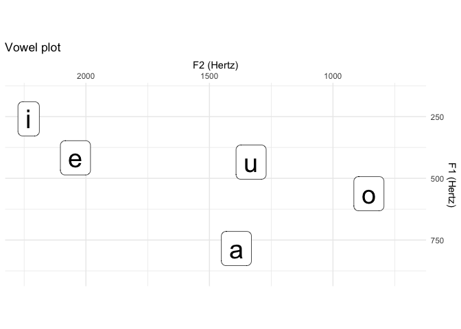

<!-- README.md is generated from README.Rmd. Please edit that file -->

# speakr: A Wrapper for the Phonetic Software Praat 

<!-- badges: start -->

[](https://cran.r-project.org/package=speakr)
[](https://cran.r-project.org/web/checks/check_results_speakr.html)
[](https://github.com/stefanocoretta/speakr/actions)
[](https://github.com/stefanocoretta/speakr)
<!-- badges: end -->

With speakr, you can run Praat scripts in R and capture their `infoLine`
output.

## Installation

You can install the released version of speakr from
[CRAN](https://CRAN.R-project.org) with:

``` r
install.packages("speakr")
```

If you want to install a stable(ish) development version, use:

``` r
remotes::install_github("stefanocoretta/speakr@devel", build_vignettes = TRUE)
```

## Use

For a quick start, check out the vignette with:

``` r
vignette("run-praat", "speakr")
```

On macOS, Linux and Windows, the path to praat is set automatically to
the default installation path. If you have installed Praat in a
different location, or if your operating system is not supported, you
can set the path to Praat with `option(speakr.praat.path)`.

For example:

``` r
option(speakr.praat.path = "./custom/praat.exe")
```

You can either run this command every time you start a new R session, or
you can add the command to your `.Rprofile` (recommended).

## Example

Use `prat_run()` to run a Praat script, and `capture = TRUE` to capture
the output of the `write/appendInfoLine` commands in the script.
Everything is set in the Praat script as usual, so you don’t have to
learn a new language to perform tasks you already know how to perform.

``` r
script <- system.file("extdata", "get-formants-args.praat", package = "speakr")

formants <- praat_run(script, "Hertz", 0.03, capture = TRUE) %>%
  read_csv()
```

Let’s check the tibble `formants`.

``` r
formants
#> # A tibble: 5 x 4
#>   vowel    F1    F2    F3
#>   <chr> <dbl> <dbl> <dbl>
#> 1 a      784. 1391. 2433.
#> 2 e      417. 2042. 2424.
#> 3 i      259. 2232. 2819.
#> 4 o      562.  855. 2463.
#> 5 u      434. 1331. 2816.
```

And let’s make a vowel plot.

``` r
formants %>%
  ggplot(aes(F2, F1, label = vowel)) +
  geom_label(size = 10) +
  labs(
    title = "Vowel plot",
    x = "F2 (Hertz)",
    y = "F1 (Hertz)"
  ) +
  scale_x_reverse(position = "top", limits = c(2250, 700)) +
  scale_y_reverse(position = "right", limits = c(900, 150)) +
  coord_fixed()
```



## Simple plotting utility

You can plot a sound file and TextGrid using Praat’s plotting
facilities.

``` r
wav <- system.file("extdata", "vowels.wav", package = "speakr")

praat_plot("vowels.png", wav, f0 = T, f0_max = 200, end = 3)
```

You can include the plot in an Rmarkdown file with knitr.

``` r
knitr::include_graphics("man/figures/vowels.png")
```


