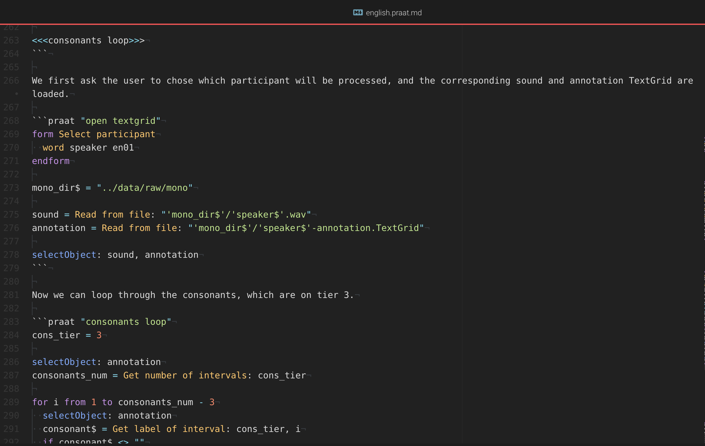
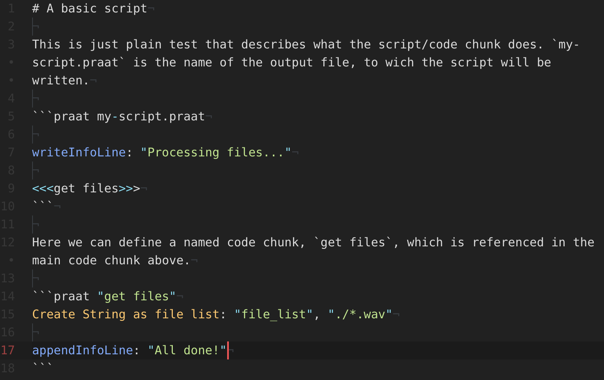

```{r setup, include = FALSE}
knitr::opts_chunk$set(
  collapse = TRUE,
  comment = "#>"
)
library(speakr)
```

If you are familiar with [literate programming](https://en.wikipedia.org/wiki/Literate_programming), literate programming with Praat is possible with Markdown and the [literate markdown tangle](https://github.com/driusan/lmt).

The following figure shows how a Praat literate Markdown document looks like.

{width=650px}

This document mixes plain text and Praat code. Praat code is fenced within code chunks like in a Markdown or R markdown document. The literate markdown tangler (`lmt`) can be used to tangle (extract) the Praat code from the source document and generate Praat scripts.

A basic Praat Literate Markdown file would look like this.

{width=650px}

To learn about the supported `lmt` syntax (how to define and reference chunks), read the `lmt` [documentation](https://github.com/driusan/lmt/blob/master/README.md).

To tangle the code in a source document, use the speakr function `lmt()`.

```{r eval=FALSE}
lmt("./my-script.praat.md")
```

The scripts defined in `my-script.praat.md` will be created in the same folder as the source document.
